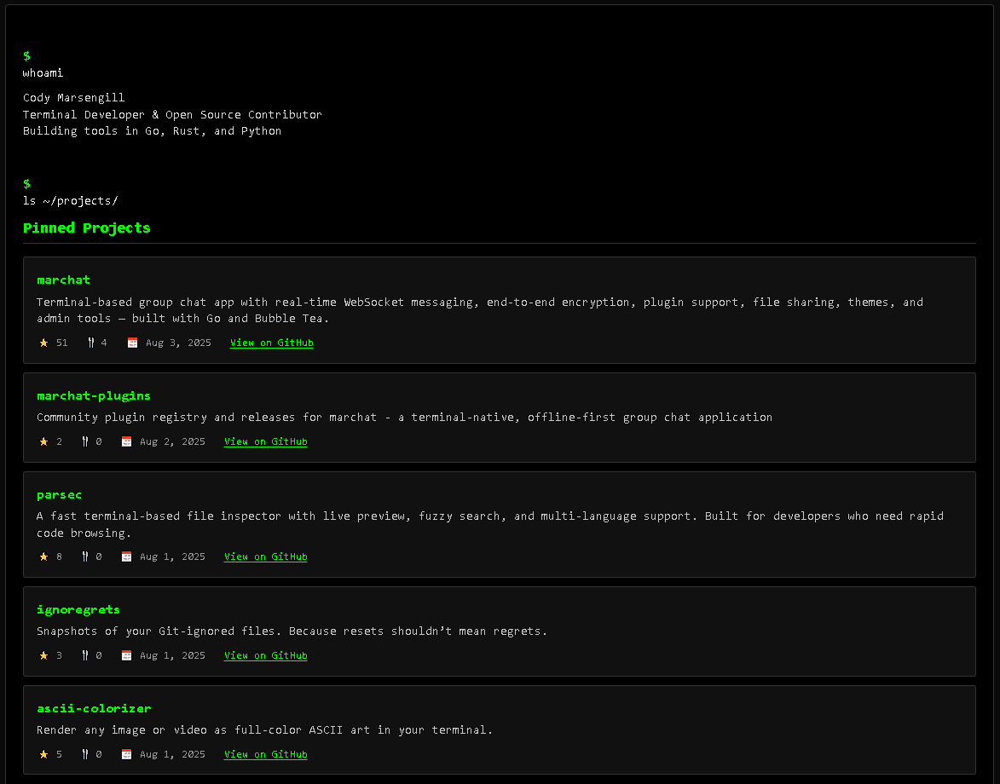

# Your Name Here - Terminal Portfolio Template

[](https://your-website-url.com/)
[](https://your-website-url.com/)

A minimal terminal-inspired personal site template showcasing open-source projects and professional background.



## Features

- Terminal-style UI with monospaced font and green-on-black theme  
- Dynamic GitHub repo data fetched with caching and fallback  
- Single standalone HTML file (~13 KB), GitHub API is the only external request  
- Responsive design for desktop and mobile  
- Semantic HTML5 structure for accessibility and SEO  
- Graceful degradation if API calls or scripts fail  
- DNS prefetch and preconnect optimizations  
- Automated HTML linting via GitHub Actions  

## Quick Start

1. **Fork this repository** or use it as a template
2. **Customize the content** in `index.html`:
   - Replace "Your Name Here" with your actual name
   - Update "Your GitHub Username" with your GitHub username
   - Replace "Your LinkedIn Username" with your LinkedIn username
   - Update "Your Website URL" with your website URL
   - Modify the PROJECTS array with your own repositories
3. **Deploy** by uploading `index.html` to any static host

## Customization

### Personal Information
- Update the meta description and title
- Modify the JSON-LD structured data
- Change the "whoami" output section
- Update contact links

### Projects
Edit the `PROJECTS` array in the JavaScript section to include your own repositories:

```javascript
const PROJECTS = [
    {
        name: 'your-project-name',
        owner: 'Your GitHub Username',
        fallbackDesc: 'Description of your project'
    },
    // Add more projects...
];
```

### Styling
The CSS is contained within the HTML file and can be customized to match your preferences.

## Deployment

Upload `index.html` to any static host like:
- GitHub Pages
- Netlify
- Vercel
- Any web server

## License

MIT License — see [LICENSE](LICENSE)
